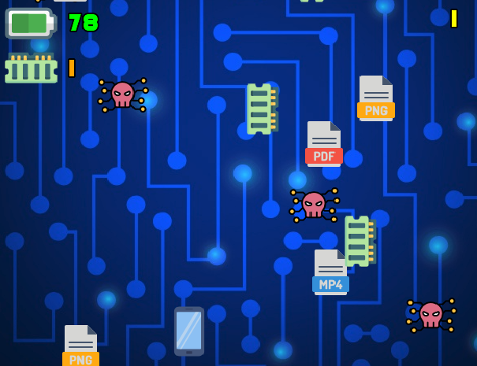

# SHOOTING PHONE

### Preprosta 2D igra razvita v Android Studio s pomočjo orodja LibGDX.

## DINAMIKA IGRE
- igralec premika svoj telefon
- poskuša 'uloviti' čim več datotek
- izogiba se virusom
- igralec pobira spomin in električne strele
- igra se zaključi, ko igralcu zmanjka baterije na telefonu

## MEHANIKA IGRE
- igralec se lahko premika levo in desno do roba okna
- virusi se pomikajo navzdol proti igralcu in praznijo baterijo ob primeru trka
- različne vrste datotek se pomikajo navzdol in ob trku štejejo kot točke
- RAM spomin se pomika navzdol in ob trku igralcu omogoča streljanje wifi signalov
- toliko spomina, kot igralec pobere, tolikokrat lahko strelja (največ 10)
- električne strele se pomikajo navzdol in povečajo procent na bateriji za 20% v primeru trka

## ELEMENTI IGRE
- igralec (telefon)
- virusi (napadalci)
- 3 vrste datotek (zbiranje točk)
- RAM stick (power up)
- električne strele (polnjenje baterije)
- števec ujetih datotek (zgoraj desno)
- števec napolnjenosti baterije telefona (zgoraj levo)
- števec metkov (zgoraj levo pod baterijo)
- glasba v ozadju
- zvočni efekti ob trku z različnimi elementi

> 
